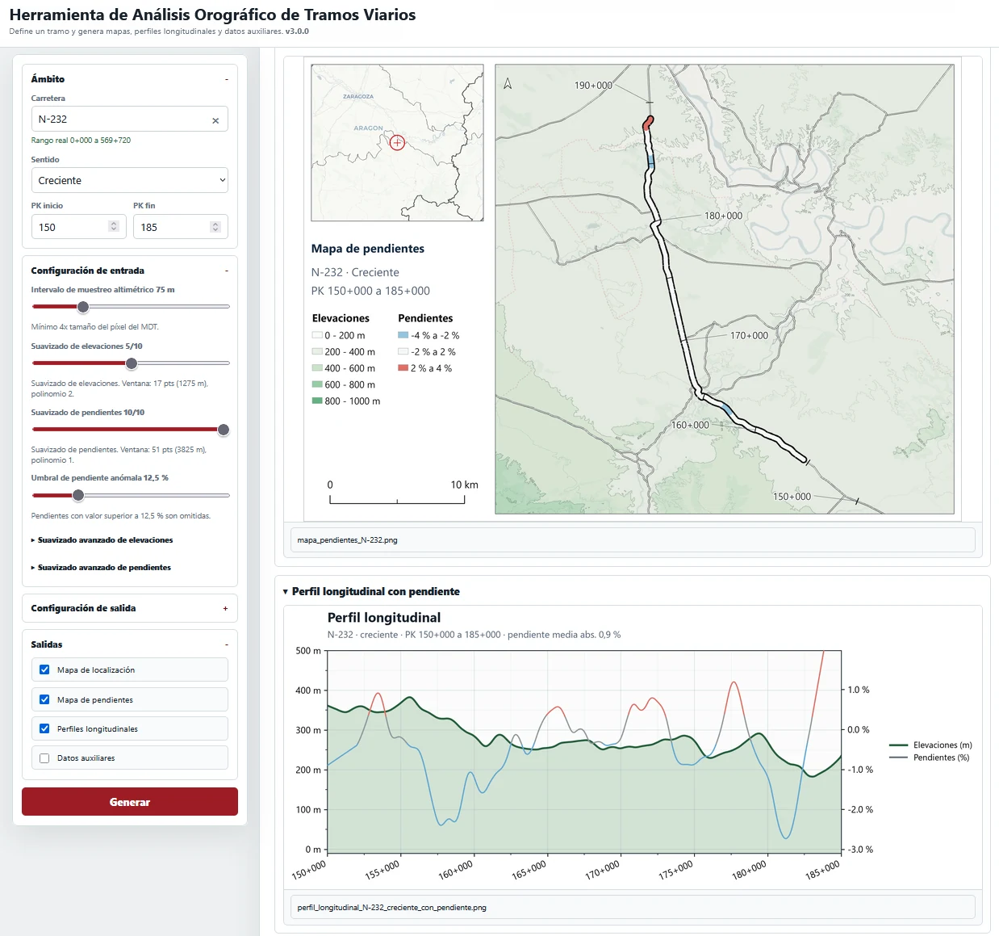
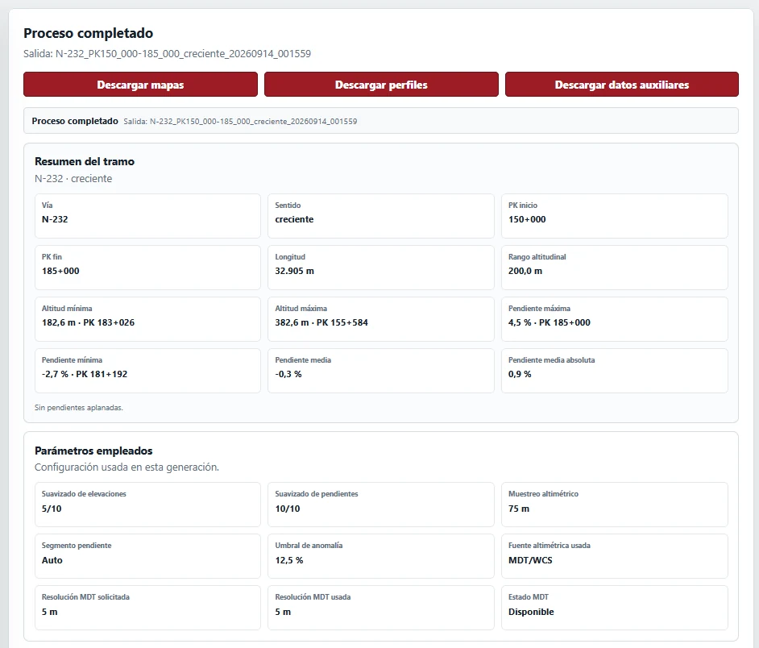

# Orografía y Localización de Tramos Viarios

Aplicación web local para analizar la orografía de un tramo de carretera a partir de su trazado y de un modelo digital del terreno.

Selecciona una vía, un sentido y dos puntos kilométricos; la herramienta obtiene la altimetría del tramo y genera **mapas, perfiles longitudinales, pendientes y métricas básicas** listas para consultar o descargar.

## Qué puede hacer

- Generar un **mapa de localización** del tramo.
- Representar las **pendientes a lo largo de la carretera**.
- Crear **perfiles longitudinales** de elevación y pendiente.
- Calcular longitud, cotas, desniveles y pendientes características.
- Ajustar el muestreo y el suavizado de elevaciones y pendientes.
- Mostrar PKs, curvas de nivel y vías de contexto.
- Exportar mapas, perfiles y, opcionalmente, datos auxiliares.
- Trabajar con **IGN gris** o **CARTO Positron** como mapa base.

<p align="center">
  
</p>

## Uso rápido

1. Añade los datos geográficos locales indicados en la sección siguiente.
2. Ejecuta `iniciar_analisis_orografico_tramos_viarios.bat`.
3. Elige **carretera**, **sentido**, **PK inicial** y **PK final**.
4. Ajusta los parámetros solo si lo necesitas.
5. Pulsa **Generar**.

El botón **? Ayuda** de la cabecera abre un manual breve sin salir de la aplicación. Incluye el significado de la resolución del MDT, el intervalo de muestreo y los suavizados.

La aplicación se abre en local, normalmente en `http://127.0.0.1:8025/`, y guarda las salidas en `Resultados/`.

## Configuración de los datos

Los GeoPackage no se incluyen en Git. Deben colocarse en:

```text
Desarrollo/data/
├── CalibradaBase.gpkg
└── LimitesAdministrativos.gpkg
```

La configuración principal está en `Desarrollo/config/config.yaml`.

### Red viaria

`CalibradaBase.gpkg` debe contener:

- una **red de carreteras calibrada**;
- una capa de **puntos kilométricos**.

Los nombres de capas y campos esperados pueden adaptarse en `config.yaml`.

Como referencia pública puede utilizarse la [Red de Carreteras del Estado calibrada](https://www.transportes.gob.es/carreteras/catalogo-y-evolucion-de-la-red-de-carreteras/archivos-geometrias-rce) del Ministerio de Transportes y Movilidad Sostenible. Puede ser necesario convertirla a GeoPackage y adaptar su esquema.

### Límites administrativos

`LimitesAdministrativos.gpkg` se utiliza para el mapa de situación y debe incluir, al menos:

- provincias;
- comunidades autónomas.

Puede prepararse a partir de cartografía administrativa pública del IGN.

Hay más detalle en [`Desarrollo/data/README.md`](Desarrollo/data/README.md).

## Cartografía y altimetría

El mapa base por defecto es el **Callejero gris del IGN** y no necesita credenciales.

También puede utilizarse **CARTO Positron**. CARTO requiere una [API key gratuita](https://carto.com/basemaps/apikey/). La herramienta puede recordarla en el **Administrador de credenciales de Windows** mediante `keyring`; la clave no se guarda en el repositorio ni en los archivos del proyecto.

La altimetría se obtiene preferentemente del **MDT del IGN mediante WCS**. La configuración permite solicitar 5 m y utilizar 25 m como fallback si es necesario.

<p align="center">
  
</p>

## Salidas

Cada ejecución crea una carpeta propia dentro de `Resultados/`. Según las opciones seleccionadas puede incluir:

- mapas de localización y pendientes;
- perfiles longitudinales;
- datos auxiliares en CSV, GeoJSON o GeoPackage;
- metadatos y log de la ejecución;
- archivos ZIP de descarga.

## Instalación

En Windows, el método más sencillo es ejecutar:

```text
iniciar_analisis_orografico_tramos_viarios.bat
```

El lanzador:

- crea `.venv` si no existe;
- instala `Desarrollo/requirements.txt`;
- detecta cambios en las dependencias mediante SHA-256;
- vuelve a instalar únicamente cuando el contenido de `requirements.txt` cambia.

El entorno validado actualmente usa Python `3.14`. Las dependencias se organizan así:

- `Desarrollo/requirements.in`: dependencias directas mantenidas por el proyecto.
- `Desarrollo/requirements.txt`: entorno reproducible con versiones fijadas; es el archivo usado por el lanzador y por CI.

Para regenerar el lock en el futuro, hazlo deliberadamente desde un entorno validado o limpio: actualiza `requirements.in` si cambian dependencias directas, regenera `requirements.txt`, reconstruye un entorno limpio y ejecuta la suite completa.

También puede arrancarse manualmente con:

```powershell
.\.venv\Scripts\python.exe .\Desarrollo\app\app.py
```

## Parámetros principales

La interfaz permite controlar, entre otros:

- resolución MDT;
- intervalo de muestreo altimétrico;
- suavizado de elevaciones;
- suavizado de pendientes;
- longitud del segmento usado para representar la pendiente;
- umbral de pendiente anómala;
- origen del eje de elevación;
- vías de fondo;
- representación de PKs;
- anotaciones de curvas de nivel;
- sentido de circulación.

La documentación técnica completa está en [`docs/DOCUMENTACION_TECNICA.md`](docs/DOCUMENTACION_TECNICA.md).

## Una limitación importante

El MDT representa el **terreno**, no necesariamente la rasante real de la carretera. En túneles, viaductos, pasos superiores y otras estructuras pueden aparecer diferencias entre la superficie del MDT y la plataforma viaria.

## Documentación

- [`docs/DOCUMENTACION_TECNICA.md`](docs/DOCUMENTACION_TECNICA.md): metodología, parámetros, composición, outputs y detalles internos.
- [`Desarrollo/data/README.md`](Desarrollo/data/README.md): preparación de las capas locales.
- `Desarrollo/docs/`: documentación histórica y notas de desarrollo.

## Licencia

El código se distribuye bajo licencia **MIT**.

Los datos, mapas base y servicios de terceros mantienen sus propias condiciones de uso y atribución.

---

**Versión actual:** `v3.1.1`
